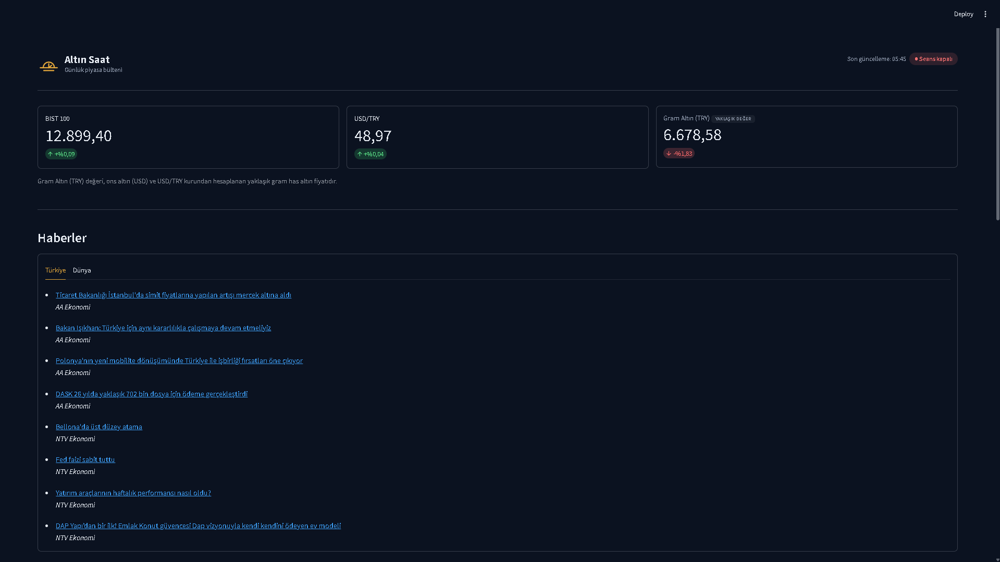
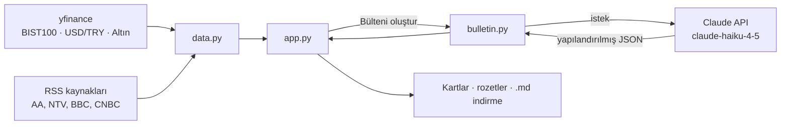
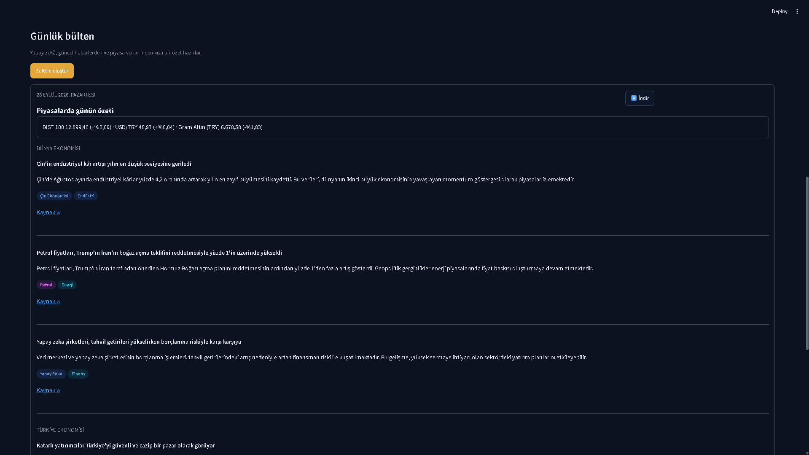

<p align="center">
  
</p>
<h1 align="center">Altın Saat</h1>
<p align="center">BIST 100, USD/TRY, gram altın ve günlük ekonomi haberlerinden yapay zekâ destekli Türkçe özet çıkaran bir Streamlit uygulaması.</p>



## Ne işe yarar

Altın Saat, güncel piyasa verilerini (BIST 100, USD/TRY, gram altın) ve Türkiye/dünya ekonomisi haberlerini tek bir sayfada toplar; isterseniz bu verilerden Claude ile kısa bir Türkçe günlük bülten ürettirebilirsiniz. Sabah birkaç RSS sitesi ve piyasa ekranı arasında gezinmek yerine, tek bakışta günün özetini görmek isteyenler için hazırlanmış kişisel bir gösterim projesidir — yatırım kararı almak için bir araç değildir.

## Özellikler

- **Koyu tema**: Renkler ve yazı tipi `.streamlit/config.toml` üzerinden tanımlanır.
- **Piyasa verisi**: BIST 100, USD/TRY ve gram altın (TRY) için gecikmeli fiyat ve günlük yüzde değişim kartları (`yfinance`).
- **Haberler**: Türkiye ve dünya ekonomisi için 2'şer RSS kaynağından son başlıklar, sekmeler halinde (`feedparser`).
- **Üst bar**: Türkiye saatiyle son güncelleme saati ve BIST seans durumu ("Seans açık" / "Seans kapalı") rozeti.
- **AI bülten**: "Bülteni oluştur" butonuyla haberler Claude API'ye gönderilir; model yapılandırılmış bir JSON döner (bölümler, madde başlığı/özeti, ilgili sektörler, kaynak linki). Sonuç sektör rozetleri ve kaynak linkleriyle gösterilir, `.md` olarak indirilebilir.

## Nasıl çalışır

Piyasa verisi ve haberler `data.py` üzerinden çekilir; "Bülteni oluştur" butonuna basıldığında bu haberler `bulletin.py` aracılığıyla Claude API'ye gönderilir ve yapılandırılmış bir JSON olarak geri döner. Arayüz bu JSON'u kartlara, rozetlere ve indirilebilir bir `.md` dosyasına dönüştürür.



## Tasarım kararları

- **Rakamları model değil kod yazar.** Bültendeki BIST/USD/altın özet satırı, Claude'un ürettiği metinden değil, uygulamanın kendi `market_data`'sından hesaplanır. Model sadece haber içeriğini (`sections`) döner; sayı uydurma riski böylece ortadan kalkar.
- **Yatırım tavsiyesi verilmez.** `bulletin.py`'deki sistem talimatı, "al", "sat", "elinde tut" gibi ifadeleri açıkça yasaklar; bülten yalnızca nötr, bilgilendirici bir dille yazılır.
- **Önemli haber yoksa uydurulmaz.** Bir bölümde (Türkiye/Dünya ekonomisi) piyasalar için gerçekten önemli bir haber yoksa model o bölüm için boş dizi döner; arayüz bunu sabit bir "öne çıkan gelişme yok" cümlesiyle gösterir.
- **Veri çekilemezse sayfa çökmez.** `data.py`, ağ hatası veya eksik veri durumunda istisna fırlatmak yerine hatayı yakalayıp ilgili karta bir uyarı olarak gösterir; diğer kartlar ve haberler normal çalışmaya devam eder.



## Kullanılan teknolojiler

- Python
- [Streamlit](https://streamlit.io/) — arayüz
- [yfinance](https://pypi.org/project/yfinance/) — piyasa verisi
- [feedparser](https://pypi.org/project/feedparser/) — RSS haberleri
- [Anthropic Claude API](https://www.anthropic.com/) (`claude-haiku-4-5-20251001`) — bülten üretimi
- [python-dotenv](https://pypi.org/project/python-dotenv/) — ortam değişkenleri

## Gereksinimler

- Python 3.14 (veya üstü)
- Windows
- Bir Anthropic (Claude) API anahtarı

## Kurulum (Windows)

```powershell
py -m venv venv
venv\Scripts\activate
pip install -r requirements.txt
```

## API Anahtarı

Proje kök dizininde bir `.env` dosyası oluşturun (yoksa) ve içine şunu ekleyin:

```
ANTHROPIC_API_KEY=sk-ant-...
```

`.env` dosyası `.gitignore` içinde hariç tutulmuştur; bu dosyayı asla git'e eklemeyin veya başkalarıyla paylaşmayın.

## Çalıştırma

```powershell
streamlit run app.py
```

Uygulama varsayılan olarak `http://localhost:8501` adresinde açılır.

## Proje Yapısı

```
piyasa-bulteni/
├── app.py                  # Streamlit sayfası ve düzeni
├── bulletin.py              # Claude API ile bülten üretimi (JSON çıktı)
├── data.py                  # Piyasa verisi (yfinance) ve haber (RSS) çekme
├── ui.py                     # Tema/rozet yardımcıları ve tek yerde toplanan özel CSS
├── assets/
│   └── logo.svg              # Altın Saat logosu (şeffaf zemin)
├── docs/
│   ├── tasarim.pdf           # Tasarım referansı
│   ├── ekran-1.png           # Genel görünüm ekran görüntüsü
│   └── ekran-2.png           # Bülten çıktısı ekran görüntüsü
├── .streamlit/
│   └── config.toml           # Koyu tema renk ve font ayarları
├── requirements.txt
└── README.md
```

## Bilinen Sınırlamalar

- Gram altın fiyatı, doğrudan bir yfinance sembolü olmadığı için ons altın (USD) ve USD/TRY kurundan hesaplanan **yaklaşık gram has altın** değeridir; kuyumcu alış/satış fiyatından farklı olabilir.
- RSS kaynakları zaman içinde adres değiştirebilir veya geçici olarak erişilemez hale gelebilir.
- Piyasa verileri ve haberler kısa süreli (`st.cache_data`) önbelleğe alınır; sayfa her yenilendiğinde anlık en güncel veri garanti edilmez.
- "Seans açık/kapalı" rozeti sabit bir saat aralığına (hafta içi 10:00–18:00, Türkiye saati) dayanır; resmi tatiller ve seans dışı özel durumlar hesaba katılmaz.

## Geliştirme Süreci

Arayüz tasarımı Claude ile hazırlandı (bkz. `docs/tasarim.pdf`), kodun tamamı Claude Code ile yazıldı. Uygulama planlarını ben onayladım, testleri ve uygulamayı bizzat ben çalıştırıp doğruladım.

---

**⚠️ Bu uygulama yatırım tavsiyesi vermez.** Gösterilen veriler ve üretilen bülten yalnızca bilgilendirme amaçlıdır; piyasa verileri gecikmeli olabilir.
